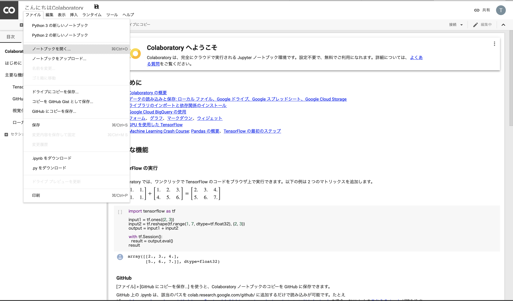
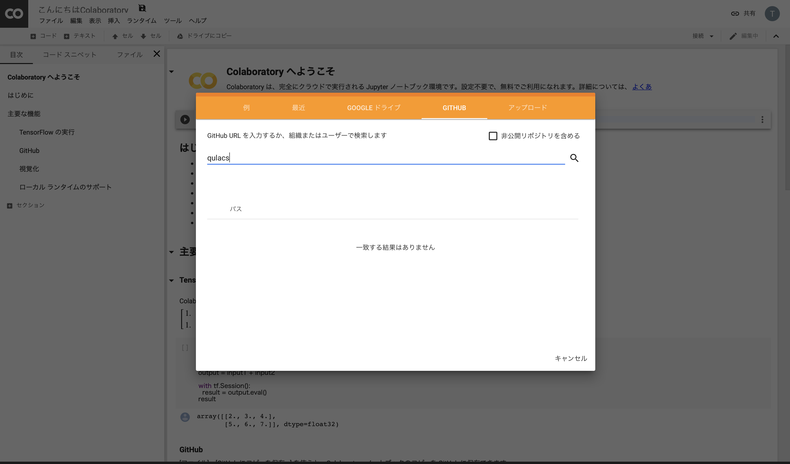
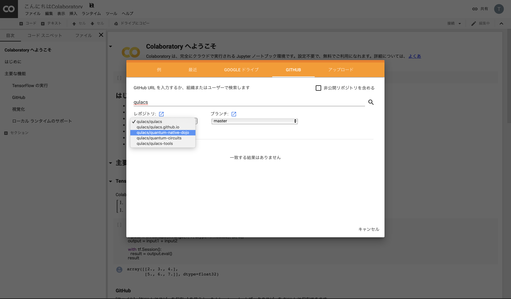
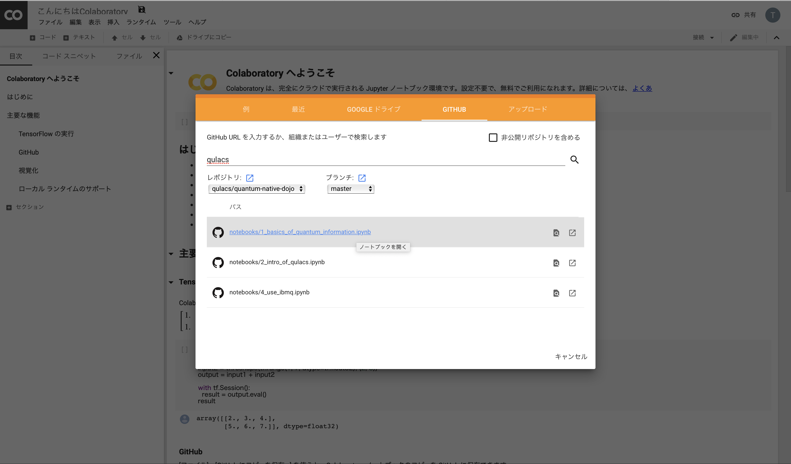

# Welcome to Quantum Native Dojo ($\beta$)!

Quantum Native Dojoは量子コンピュータについて勉強したいと思っている方のために作られた自習教材です。

量子コンピュータの基本的な動作原理から、基礎アルゴリズム、それらを応用してどのように化学計算や金融計算などに役立てるかを学ぶことができます。本教材は誤り訂正の有る量子コンピュータのアルゴリズムの他、数年以内に実用されるであろう誤り訂正のないNISQ (Noisy Intermidiate-Scale Quantum) デバイスのアルゴリズムもカバーしています。

全ての教材が `Jupyter notebook` で製作され、そのまま Google Colaboratory 上で実行可能になっているので、面倒な環境設定をすることなく学習を始めることが可能です。

## この教材の意義： Becoming Quantum Native
量子コンピュータは、量子力学の原理に基づいて計算を行います。一方、私達がふだん目にする物理現象は主に古典力学に支配されています。ここに「量子コンピュータは難しい」と思われる原因の一端があります。

Quantum Native Dojoでは、みなさまに量子コンピュータの動作を感覚的に理解して使いこなせる**Quantum Native**になっていただくことを目標としています。Quantum Nativeへの道のりは簡単ではありませんが、このDojoを通して基礎からじっくりと量子力学と量子コンピュータの原理・応用を学ぶことが着実な一歩となるでしょう。

このDojoを巣立ち、Quantum Nativeとなったみなさまが様々な量子アルゴリズム/アプリケーションを作るエンジニアとして活躍されることを期待しています！

## 前提となる知識
Quantum Native Dojoの内容を理解するには、以下のような知識が必要です。
- 複素数とは何か
- 簡単な関数(sin, cos, exp, ...)の微積分
- 行列とベクトルの掛け算、対角化とは何か

## 教材の進め方
基本的に、このレポジトリの"notebook"フォルダ以下にある `Jupyter notebook` を読みながら/実行しながら進めていきましょう。
各 `Jupyter notebook` は `Google Colabolatory` で実行することができるので、自前で環境を構築する必要はありません。
(もちろん、Pythonに詳しい方は手元でnotebookを実行して納得するまで使い倒してください)

### `Google Colabolatory`  上で実行する場合
1. [Google Colabolatory](https://colab.research.google.com/notebooks/welcome.ipynb?hl=ja) のページを開きます
2. `ファイル` > `ノートブックを開く` を選択します

3. `GITHUB` のタブを選択し、ノートブックの絞り込みの欄に `qulacs` と入力します

4. レポジトリのプルダウンで `qulacs/quantum-native-dojo` を選択し、ブランチで `master` を選択します

5. 開きたいノートブックを選択します

### `Jupyter notebook` で実行する場合
1. [Quantum Native Dojo のリポジトリ](https://github.com/qulacs/quantum-native-dojo) をフォークします
2. Console から `$ jupyter notebook` で[ノートブックを起動](https://jupyter.readthedocs.io/en/latest/running.html#running)させます

`Jupyter` を起動させるためには `Python 3.3` 以上と `Jupyter` をインストールする必要があります。

また、ノートブックに埋め込まれているコードを実行するためには、`numpy`、`scipy`、`sympy` をインストールする必要があります。
上記のパッケージをまとめてインストールするには `anaconda3` のインストールが便利です。

## 目次 (仮)
### 1. 量子情報理論入門 
#### 1.1 量子情報の基礎
- 量子ビット
- 基本演算
- 複数量子ビットの表現
#### 1.2 量子アルゴリズム入門(アダマールテスト・位相推定)
- ~~量子フーリエ変換~~
- アダマールテスト
- 位相推定アルゴリズム
- 素因数分解

### 2. 様々な量子アルゴリズム
1. ~~Groverのアルゴリズム~~
2. ~~Harrow-Hassidim-Lloydアルゴリズム~~

### 3. NISQ (Noise Intermidiate-Scale Quantum) アルゴリズム
1. ~~NISQとは~~
2. ~~Variational quantum eigensolver (VQE)~~
3. ~~Quantum Approximate Optimization Algorithm (OAOA)~~
4. ~~Quantum circuit learning~~
5. ~~error mitigation technique~~

### 4. NISQの実機を触ってみる
1. ~~IBM Q Experienceの実行とQuantum Volumeの測定~~

### 5. 量子化学計算実践
1. ~~Openfermionの使い方~~
2. ~~位相推定・VQEを使って分子の基底状態エネルギーを求めてみる (H2, LiH, etc)~~
3. ~~励起状態を求める (subspace-variational quantum eigensolver)~~

### 6. 量子機械学習実践
1. ~~HHLアルゴリズムを用いたポートフォリオ最適化~~
2. ~~Quantum circuit learningを用いた分類器作製~~

### 7. 誤り訂正理論
1. ~~古典誤り訂正と量子誤り訂正~~

## 参考文献
量子力学・量子コンピュータについてより詳しく知りたい/深く理解したい場合には、以下のような参考書をオススメします。
- 量子力学について：
  - 清水明「[量子論の基礎 - その本質のやさしい理解のために](
https://www.amazon.co.jp/dp/4781910629)」、サイエンス社 (2004)
- 量子コンピュータ・量子アルゴリズムについて：
  - 竹内 繁樹「[量子コンピュータ - 超並列計算のからくり](https://www.amazon.co.jp/dp/4062574691)」、講談社 (2005)

また、英語に抵抗がない場合、量子コンピュータの金字塔とも言えるNiesen-Chaungの教科書を読むのがベストです(分量が多いので、時間はかかります)。
- M. Nielsen and I. Chuang,  "[Quantum Computation and Quantum Information: 10th Anniversary Edition](https://www.amazon.co.jp/dp/1107002176)", Cambridge University Press (2010)

## Community
本教材について分からないことは以下のコミュニティで聞いてください。  
[Qulacs Slack Community](https://join.slack.com/t/qulacs/shared_invite/enQtNDY3Njc1NjU5MDE1LTY4MTNlNDQzYjA1ZGUzZGFiNDQ1MzE2Yjg4ZmM4YjUyNGM0NmNmMjA5NmI2YWFlZDk2ODE1OTUzZTE5YjRmZWU)

## 本教材の作者
本教材は[株式会社QunaSys](https://qunasys.com)と以下のContributorの方々によって作製・メンテナンスされています。

### Contributors
[Keisuke Fujii](http://quantphys.org/wp/keisukefujii/),
[kwkbr](https://github.com/kwkbtr),
[MakotoNakai](https://github.com/MakotoNakai),
[yoooopeeee](https://github.com/yoooopeeee),
[Kosuke Mitarai](https://scholar.google.com/citations?user=TfsGcnMAAAAJ),
[Yuya-O-Nakagawa](https://scholar.google.co.jp/citations?user=LyU8LXsAAAAJ),
[yamamoto-takahiro](https://github.com/yamamoto-takahiro)